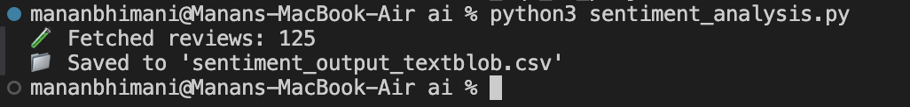
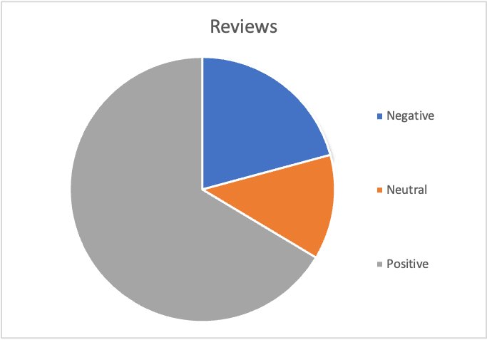
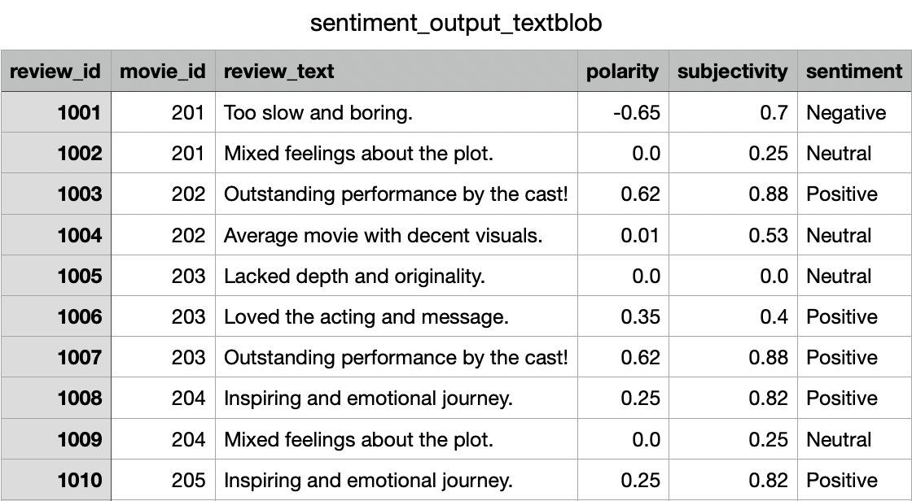
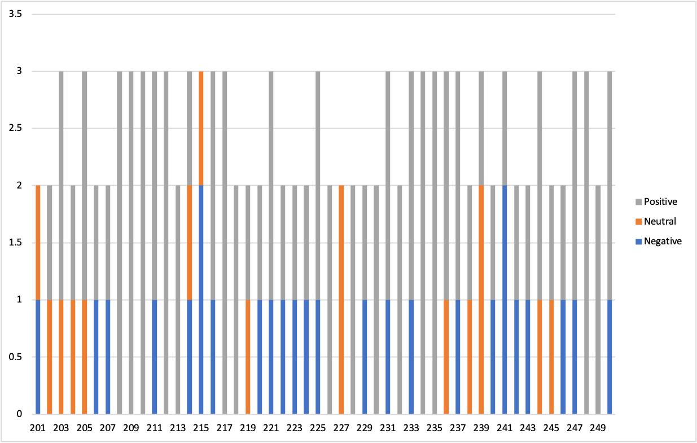

# Bollywood Movie Analytics Project

This is a project I made to practice my SQL and Python skills. I worked with a dataset of Bollywood movies and their user reviews (which I created) and tried to generate insights using queries and basic AI-based sentiment analysis.

## What I Did

- Imported CSV files (movies + reviews) into MySQL
- Wrote SQL queries to find profitable movies, average revenue by genre, top-rated movies, etc.
- Used Python (with TextBlob) to do basic sentiment analysis on the review texts
- Saved the output with sentiment labels (positive, neutral, negative)
- Tried to visualize the results in Excel (some worked, some didn’t)

## Tools I Used

- MySQL Workbench
- Python (pandas, TextBlob)
- Excel (for basic charts)

## What I Learned

- How to write and organize SQL queries for real datasets
- How sentiment analysis works using polarity and subjectivity
- How to use Python with MySQL and save results to CSV
- That sometimes AI tools need tweaking and quota limits

## Screenshots

- Python Command Terminal

- Sentiment Chart (Numbers)

- AI-Generated Sentiment CSV

- Revenue Pivot (Excel)

## Next Steps

I'll try improving the visual part and maybe link it with Power BI or a dashboard next.

This was my first end-to-end project combining SQL and AI.